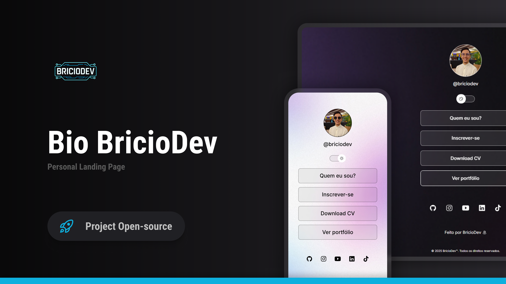

# 🌐 BricioDev - Página de Links e Portfólio

Este projeto é uma **landing page pessoal** desenvolvida por [@briciodev](https://www.instagram.com/briciodev), com o objetivo de centralizar links importantes, como redes sociais, currículo, portfólio e informações sobre o autor.

  <a href="https://bricio29.github.io/Bio-BricioDev/">Projeto</a>&nbsp;&nbsp;&nbsp;

  

 

  

## 🚀 Tecnologias

Esse projeto foi desenvolvido com as seguintes tecnologias:

- HTML e CSS
- JavaScript
- Git e Github

## 💻 Projeto

Bio BricioDev é um agregador de links para usar como cartão de visitas online.

## 📸 Preview

Você pode visualizar o site diretamente [clicando aqui](https://bio-briciodev.vercel.app/).

## ✨ Créditos

Desenvolvido com 💻 por **BricioDev**  
[LinkedIn](https://www.linkedin.com/in/briciodev) | [YouTube](https://www.youtube.com/@BricioDev) | [GitHub](https://github.com/bricio29)

---

© 2025 BricioDev™. Todos os direitos reservados.
